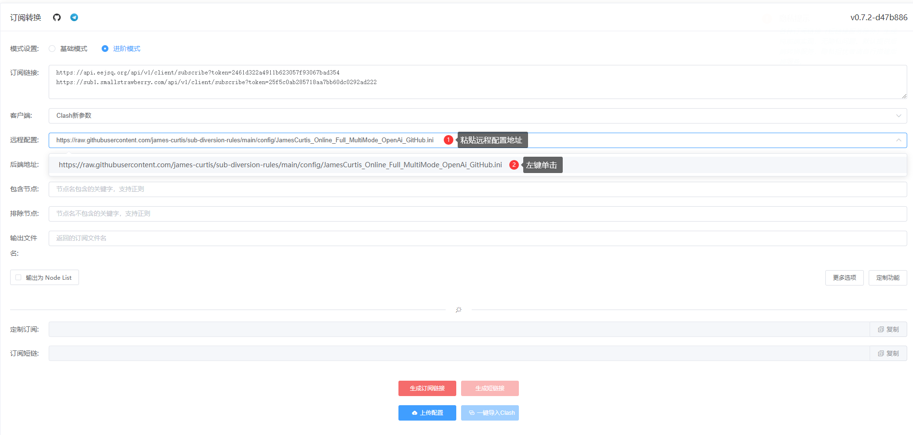

# sub-diversion-rules
我的subconverter自定义分流规则

订阅转换：https://acl4ssr-sub.github.io/

远程配置：
1. `https://raw.githubusercontent.com/james-curtis/sub-diversion-rules/main/config/JamesCurtis_Online_Full_MultiMode_OpenAi_GitHub.ini`
2. `https://raw.githubusercontent.com/james-curtis/sub-diversion-rules/main/config/JamesCurtis_Online_Full_MultiMode_OpenAi_GitHub_mini.ini`
3. `https://raw.githubusercontent.com/james-curtis/sub-diversion-rules/main/config/main.toml`
4. `https://raw.githubusercontent.com/james-curtis/sub-diversion-rules/main/config/meta.toml`

| 规则名称                                                 | 说明                                       |
| -------------------------------------------------------- | ------------------------------------------ |
| JamesCurtis_Online_Full_MultiMode_OpenAi_GitHub.ini      | 完整版规则（分流规则计算比较消耗cpu）      |
| JamesCurtis_Online_Full_MultiMode_OpenAi_GitHub_mini.ini | 精简版规则                                 |
| main.toml                                                | 精简版规则（推荐，支持分流 git ssh）       |
| meta.toml                                                | 精简版 Meta 规则（推荐，支持分流 git ssh） |

## git ssh 分流方法

（推荐）在混合配置中选择 `JavaScript`，并写入以下内容
```js
module.exports.parse = ({ content, name, url }, { yaml, axios, notify }) => {
  content.rules.unshift(`SCRIPT,git-ssh-github,🚧 GitHub ssh git,no-resolve`)
  return content
}
```

**或者**

在配置文件rules代码块顶部添加一条规则：

`SCRIPT,git-ssh-github,🚧 GitHub ssh git,no-resolve`

添加完成后类似下文

```yaml
...
rules:
 - SCRIPT,git-ssh-github,🚧 GitHub ssh git,no-resolve
 - ...
```


# 使用示例



# 我的机场
- hiclouda.com
- dash.fscloud.cc
- www.eevpn.com
- 一元机场.com
- bai.ee
- 一元者也.com
